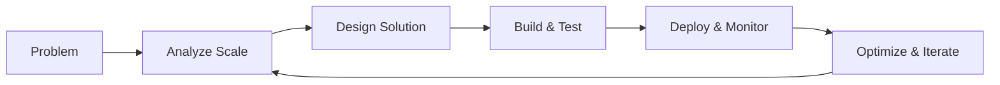

# Hi there! I'm Deepanshu Maheshwari 👋

## 🚀 Software Engineer III | Infrastructure & AI Specialist

I'm passionate about building scalable distributed systems and implementing cutting-edge AI solutions that drive real business value.

### 💼 About My Work
Most of my production code resides in private enterprise repositories at Walmart Global Tech. This GitHub showcases:
- 📚 Learning projects and experiments
- 🛠️ Generic utilities inspired by production work
- 📖 Technical documentation and best practices
- 🎯 Problem-solving approaches (LeetCode, System Design)

### 🏆 Impact & Achievements
- 📈 Built systems processing **2M+ pages monthly** with 99.9% uptime
- 💰 Reduced operational costs by **40%** through automation
- ⚡ Improved deployment efficiency by **75%** (4 hours → 1 hour)
- 🎯 Generated **$2M+** in business value through SEO optimization
- 🔧 Handle **10M+ daily transactions** in production systems
- 🏅 **Q2 2025 Bravo Award Winner** for automation innovation

### 🛠️ Technologies I Work With Daily

#### Languages & Frameworks

#### Infrastructure & DevOps

#### Big Data & Databases

#### AI/ML & Cloud

### 📊 My Approach to Engineering

### 🎯 Ask Me About
- **Scaling systems** to handle millions of daily transactions
- **Building SEO infrastructure** for e-commerce at scale
- **Implementing production ML/AI pipelines** with LLMs and GenAI
- **Performance optimization** for distributed systems
- **CI/CD automation** and DevOps best practices
- **Cross-functional collaboration** between engineering and data science teams

<!-- ### 📈 GitHub Stats
 -->

### 🏅 Competitive Programming
- **LeetCode:** [GiyuTomioka007](https://leetcode.com/u/GiyuTomioka007/) - 500+ problems solved
- **Focus Areas:** Dynamic Programming, Graph Algorithms, System Design

### 📫 Connect With Me
- 💼 [LinkedIn]([https://linkedin.com/in/deepanshu-maheshwari](https://www.linkedin.com/in/deepanshu-maheshwari-748823172/))
- 📧 [Email](mailto:deepanshumaheshwarri99@gmail.com)
- 📝 [Technical Blog](https://github.com/deepanshu/technical-blog) (Coming Soon)

### 🌟 Featured Projects
This portfolio contains sanitized, generic versions of production solutions:
- 🔄 **ETL Pipeline Framework** - Processing 100K+ products daily with LangChain integration
- 📊 **Monitoring Dashboard** - Real-time alerting achieving 99.99% uptime  
- 🚀 **Spark Optimization Toolkit** - Performance improvements of 60%+
- 🔧 **CI/CD Automation Suite** - Award-winning automation (Q2 2025 Bravo Award)
- 🤖 **AI/ML Pipelines** - OpenAI API & BERT model implementations for SEO

---

*"Building reliable systems that scale is not just about technology, it's about understanding the business impact of every line of code."*
